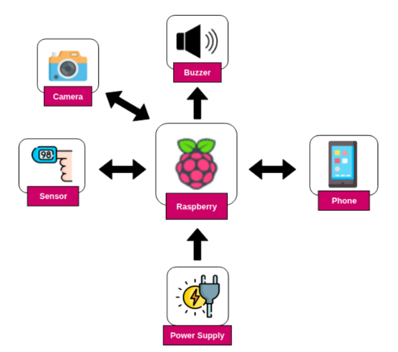
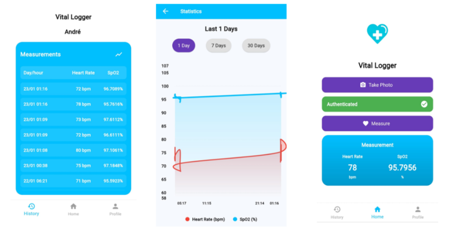
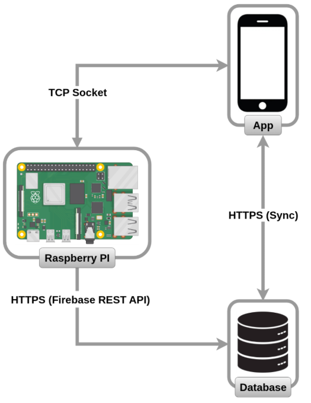
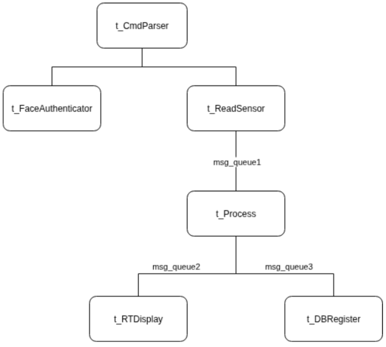
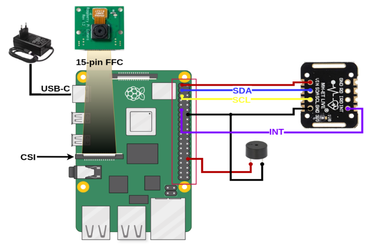

# Vital Logger

Embedded system for portable heart-rate and SpO₂ monitoring with face-based authentication, real-time cloud synchronization, and a Flutter mobile/web UI. Developed as the final project for the Embedded Systems course of the MSc in Industrial Electronic Engineering and Computers at the University of Minho.

<p align="center">
  
  
</p>

---

## Overview

Vital Logger is a self-contained biometric monitoring device. A user authenticates with facial recognition, performs a 5-second PPG measurement via an integrated finger sensor, and has the results automatically timestamped and logged to a personal history in the cloud. A companion Flutter app drives the device remotely, shows live readings, and renders historical trends.

The project spans the full embedded stack:

- A **custom Linux image** built with Buildroot for Raspberry Pi 4B
- A **kernel-level character device driver** for the piezoelectric buzzer (direct GPIO register access)
- A **multi-threaded C++ application** using POSIX threads, priorities (`SCHED_FIFO`), message queues, semaphores and mutexes
- **Digital signal processing** (cascaded IIR band-pass + Savitzky–Golay smoothing, peak detection, ratio-of-ratios SpO₂)
- **Deep-learning facial authentication** with OpenCV DNN (YuNet detector + SFace recognizer)
- A **Flutter web/mobile client** with Firebase Auth, Realtime Database, and Storage
- A **hybrid communication architecture** — TCP sockets over an Ngrok tunnel for live commands, REST (libcurl + Firebase REST API) for persistence

---

## Features

- Facial authentication before each measurement, with an audible buzzer alert on mismatch
- Continuous PPG acquisition at 100 Hz from a MAX30102 sensor over I²C with hardware-interrupt synchronization
- Real-time heart rate and SpO₂ streamed to the app every second during acquisition
- Measurements persisted to Firebase with timestamp and user ID; full history browsable in-app
- Charts for BPM and SpO₂ trends over the last 1 / 7 / 30 days
- Remote-access ready: the device can be driven from anywhere via the Ngrok tunnel
- 3D-printed enclosure

---

## System architecture

The device, the app, and the cloud communicate through two separate channels. Commands flow over a TCP socket (Raspberry ↔ App) for low latency; measurement data flows over HTTPS to Firebase (Raspberry → Cloud → App) for persistence and live sync.

<p align="center">
  
</p>

On the device, the application is organized as six concurrent POSIX threads communicating through three message queues, following a producer–consumer pipeline:

<p align="center">
  
</p>

| Thread | Role | Priority |
|---|---|---|
| `t_ReadSensor` | Reads the MAX30102 FIFO on interrupt, discards warm-up samples, batches into queue #1 | Highest |
| `t_Process` | Consumes raw samples, runs the PPG pipeline, dispatches live results to queue #2 and final results to queue #3 | High |
| `t_RTDisplay` | Pushes live BPM/SpO₂ to Firebase for the app's real-time view | Medium |
| `t_DBRegister` | Persists the final measurement to the Firebase history | Medium-low |
| `t_FaceAuthenticator` | Captures, aligns and compares the user's face against the stored profile photo | Medium-low |
| `t_CmdParser` | HTTP server thread; dispatches incoming commands from the app | Lowest |

See [`firmware/README.md`](firmware/README.md) for the full class diagram, design-pattern choices (Strategy, Facade), and the signal-processing implementation.

---

## Tech stack

| Layer | Technologies |
|---|---|
| OS & build | Buildroot 2025.02, Linux kernel 6.6 (ARM64) |
| Firmware | C++17, POSIX threads, POSIX message queues, libcurl, OpenCV 4 (DNN, objdetect, videoio) |
| Kernel module | C, Linux character device API, `ioremap`, direct BCM2711 GPIO register access |
| Sensor I/O | I²C (`MAX30102` IIO driver), GPIO interrupt via `sysfs` |
| Camera | libcamera + GStreamer (`libcamerasrc`) |
| Cloud | Firebase Authentication, Realtime Database, Storage — via REST API |
| App | Flutter 3, Firebase SDK, `fl_chart`, `http` |
| Tunneling | Ngrok static domain (for remote access behind NAT) |
| Tooling | VS Code, draw.io, Figma, TinkerCAD |

---

## Hardware

| Component | Role |
|---|---|
| Raspberry Pi 4B (2 GB) | Central processor, running the custom Linux image |
| MAX30102 | Red + IR LED pulse oximeter & heart-rate sensor (I²C, 18-bit ADC, 32-sample FIFO) |
| Raspberry Pi Camera Module (5 MP) | Face capture for authentication (CSI port) |
| Buzzer BPT-14X | Audible authentication-error alert (GPIO 12) |

<p align="center">
  
</p>

Pin mapping:

| GPIO | Function | Device |
|---|---|---|
| GPIO 2 (Pin 3) | I²C SDA | MAX30102 |
| GPIO 3 (Pin 5) | I²C SCL | MAX30102 |
| GPIO 17 (Pin 11) | External interrupt (falling edge) | MAX30102 |
| GPIO 12 (Pin 32) | Digital output | Buzzer |
| 3.3 V (Pin 1) | Power | MAX30102 |
| GND (Pin 14) | Ground | MAX30102 + Buzzer |

---

## Repository layout

```
vital-logger/
├── firmware/           C++ application running on the Raspberry Pi
├── kernel-driver/      Character device driver for the piezoelectric buzzer
├── app/                Flutter web/mobile client
└── docs/
    ├── images/         Diagrams and UI screenshots (used in READMEs)
    └── VitalLogger_report.pdf   Full technical report (90 pages)
```

Each subdirectory has its own README with build and run instructions.

---

## Build & run

The three components are built and deployed independently. Summaries below; full instructions in the sub-READMEs.

**1. Custom Linux image** (not included in this repo — generated with Buildroot 2025.02)
See [`firmware/README.md`](firmware/README.md#buildroot-configuration) for the required kernel modules and user-space packages (`opencv4`, `libcurl` with OpenSSL, `libcamera`, `chrony`, `wpa_supplicant`, `ca-certificates`, MAX30102 IIO driver, etc.).

**2. Kernel driver**
```bash
cd kernel-driver
make              # cross-compiled against the Buildroot kernel
# on the Pi:
insmod buzzer.ko
```
See [`kernel-driver/README.md`](kernel-driver/README.md).

**3. Firmware**
```bash
cd firmware
./deploy.sh       # cross-compiles with the Buildroot toolchain and scp's the binary to the Pi
```
See [`firmware/README.md`](firmware/README.md).

**4. Flutter app**
```bash
cd app/flutter_application_1
flutter pub get
flutter run -d chrome           # web
# or
flutter run                     # connected Android / iOS device
```
See [`app/README.md`](app/README.md) for Firebase configuration.

---

## Documentation

The full 90-page technical report is available in [`docs/VitalLogger_report.pdf`](docs/VitalLogger_report.pdf). It covers requirements analysis, use-case and finite-state-machine modelling, hardware specification, software architecture (package, class, and thread diagrams), database design, test cases, and a detailed walkthrough of the implementation.

---
