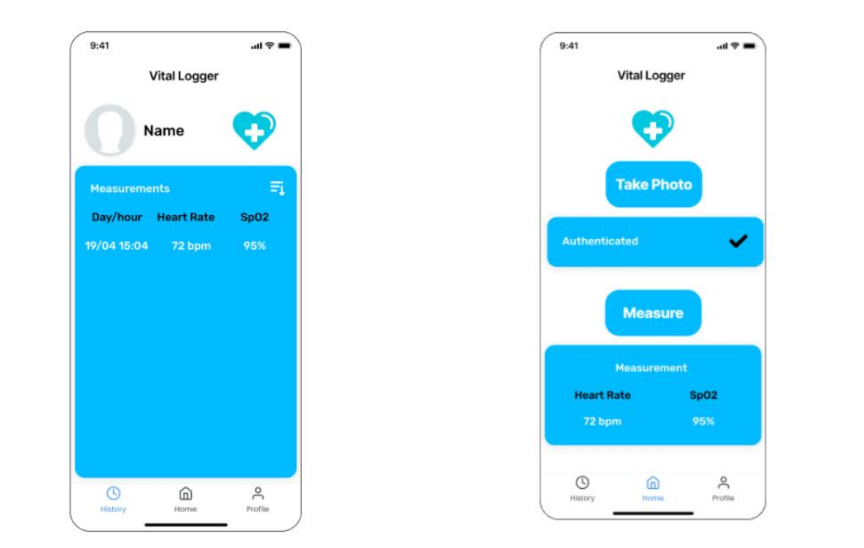

# Vital Logger — App

Flutter client for the Vital Logger device. Targets web, Android, and iOS from a single codebase. Talks to the device over HTTP (via an Ngrok tunnel) and to Firebase directly for user data and measurement history.

<p align="center">
  
  
</p>

## Features

- Email + password sign-up and login (Firebase Auth)
- Profile picture upload (Firebase Storage)
- One-tap facial authentication: triggers the device's camera via HTTP, waits for the result in the Realtime Database
- Measurement control: starts a 5-second reading on the device
- Live BPM and SpO₂ updates every second during a measurement (via a Realtime Database listener, not polling)
- Measurement history with sortable list and trend charts (`fl_chart`) over 1 / 7 / 30 days

## Architecture

The app uses **Command-Query Separation**:

- **Commands** (`START_AUTH`, `START_MEASURE`) — sent as HTTP POST to the Raspberry Pi through the Ngrok tunnel; the response is just an acknowledgement.
- **Queries** — reactive Firebase listeners on `measurements/<uid>/live` (for the active reading) and `measurements/<uid>/history/*` (for the list and charts). No polling.

Because browsers block plain HTTP requests from an HTTPS-hosted page, and because the Pi is behind NAT, the device is exposed via a fixed Ngrok domain that handles both concerns (TLS termination + inbound tunneling).

## Project structure

```
app/flutter_application_1/
├── lib/
│   ├── main.dart
│   ├── firebase_options.dart       generated by flutterfire configure
│   ├── firebase_config.dart        web config map
│   ├── models/                     Measurement model
│   ├── services/                   Auth + Realtime DB helpers
│   └── screens/
│       ├── launch_page.dart
│       ├── enter_page.dart
│       ├── login_page.dart
│       ├── signup_page.dart
│       ├── home_page.dart          Main screen: auth + measure buttons + live values
│       ├── auth_process_page.dart
│       ├── history_page.dart       Past measurements list
│       ├── stats_page.dart         BPM + SpO₂ charts
│       ├── profile_page.dart
│       └── edit_profile_page.dart
├── assets/images/                  Logo assets
├── web/                            Web entry point
├── android/, ios/, linux/, macos/, windows/
└── pubspec.yaml
```

## Dependencies

From `pubspec.yaml`:

- `firebase_core`, `firebase_auth`, `firebase_database`, `firebase_storage`
- `http` — commands to the Raspberry Pi
- `fl_chart` — historical trend charts
- `image_picker` — profile photo selection
- `intl` — date formatting

## Run locally

```bash
cd app/flutter_application_1
flutter pub get
flutter run -d chrome        # web
# or
flutter run                  # connected mobile device
```

## Firebase setup

The app expects a Firebase project with:

- Email/password authentication enabled
- A Realtime Database with these rules (users only read/write their own data; the device uses the database secret to write any user's data):
  ```
  users/<uid>                 — profile info + current_session
  measurements/<uid>/live     — live reading, updated every 1 s during acquisition
  measurements/<uid>/history/<auto-id>  — saved measurements { bpm, spo2, timestamp }
  ```
- A Storage bucket with:
  ```
  profilePics/<uid>.jpg       — reference photo for face verification
  auth_attempts/<uid>_latest.jpg  — audit log of authentication attempts
  ```

The web API keys in `firebase_config.dart` and `firebase_options.dart` are Firebase-public identifiers (they identify the project, not authenticate it) and are safe to commit. Access control is enforced by Firebase Security Rules.

## Pairing with the device

The file that talks to the Pi hard-codes an Ngrok URL (the author's). For reproduction:

1. Install Ngrok on the Raspberry Pi and claim a static domain.
2. On the Pi: `ngrok http 8080`.
3. Replace the URL in the app's command-sending helper (search for `ngrok-free.dev`) with your own static domain.

## Build for web

```bash
flutter build web
# output in build/web/ — deployable to Firebase Hosting, GitHub Pages, etc.
```
