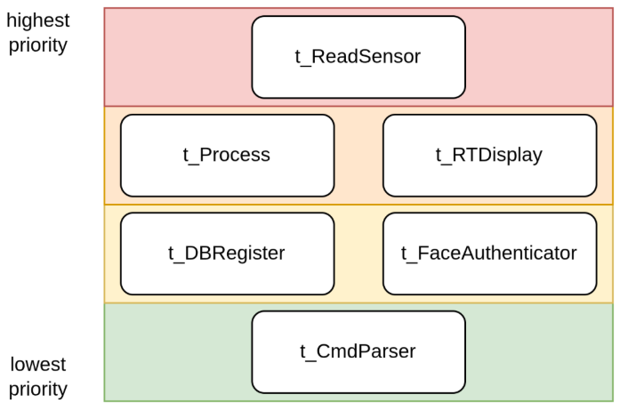
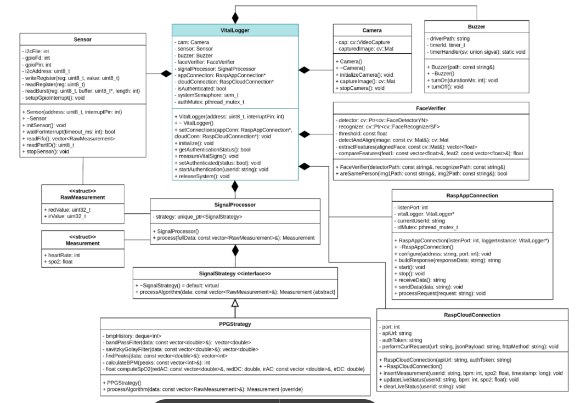

# Firmware

The C++ application that runs on the Raspberry Pi 4B. It orchestrates sensor acquisition, signal processing, facial authentication, kernel-driver-backed buzzer control, and bidirectional communication with both the mobile app (TCP) and Firebase (HTTPS).

## Architecture

Six concurrent POSIX threads communicate through three message queues. Thread priorities follow a real-time rationale: sensor acquisition must never miss an interrupt, so it runs at the highest priority under `SCHED_FIFO`. Network I/O runs at the lowest, since it can tolerate jitter.

<p align="center">
  
</p>

<p align="center">
  
</p>

## Class design

The application uses object-oriented design with two recurring patterns:

- **Strategy** for signal processing. `SignalProcessor` holds a `std::unique_ptr<SignalStrategy>` and delegates to whichever concrete strategy is plugged in. `PPGStrategy` is the current implementation; replacing it with, e.g., an FFT-based algorithm requires no changes elsewhere.
- **Facade** in `VitalLogger` and `FaceVerifier`. `VitalLogger` exposes a minimal public interface (`initialize`, `startAuthentication`, `measureVitalSigns`, `releaseSystem`) that hides the interaction between Camera, Sensor, Buzzer, FaceVerifier, SignalProcessor and the two Connection classes.

<p align="center">
  
</p>

## Signal processing pipeline

Each measurement collects 500 PPG samples at 100 Hz (5 seconds). The first 300 samples after finger detection are discarded as a warm-up to let the baseline stabilize. The pipeline then:

1. Separates the raw stream into Red and IR channels and computes each one's DC level.
2. Runs a cascaded **IIR band-pass filter** to remove baseline drift (high-pass) and high-frequency noise (low-pass).
3. Applies a 5-point **Savitzky–Golay smoothing filter** that preserves the sharp systolic peaks while reducing residual noise.
4. Detects peaks with a robust threshold (90th-percentile max × 0.4) and a 250 ms minimum inter-peak distance to avoid double-counting the dicrotic notch.
5. Computes BPM from the average inter-peak interval.
6. Computes SpO₂ via the **ratio-of-ratios** method: R = (RedRMS / RedDC) / (IRRMS / IRDC), then SpO₂ ≈ 104 − 17·R.
7. Applies a moving-average window over the BPM history for stability.

Intermediate (100/200/300/400 samples) and final (500 samples) results are dispatched on separate message queues so the app can display a live value every second while the final, validated measurement is persisted only once.

## Facial authentication

`FaceVerifier` wraps two pre-trained OpenCV DNN models:

- **YuNet** (`face_detection_yunet_2023mar.onnx`) for face detection and five-point landmark extraction.
- **SFace** (`face_recognition_sface_2021dec.onnx`) for feature-embedding extraction.

The captured frame and the stored profile photo are both detected, aligned (landmark-driven warping), embedded, and L2-normalized. The verifier then computes the cosine distance between the two embeddings; a value below the configured threshold means "same person".

The authentication thread also uploads every attempt photo to Firebase Storage under `auth_attempts/<userId>_latest.jpg`, providing an audit trail of access attempts.

## Communication

Two dedicated classes, both written around libcurl:

- **`RaspAppConnection`** — a small TCP HTTP/1.1 server listening on port 8080. Uses `SO_REUSEADDR` to survive restarts cleanly, handles CORS pre-flight (`OPTIONS`) for browser clients, correctly parses `Content-Length`, and re-reads from the socket until the full body arrives (robust to TCP fragmentation). Long-running commands (`START_MEASURE`) are dispatched to a detached worker thread so the HTTP reply is sent immediately.
- **`RaspCloudConnection`** — REST client for the Firebase Realtime Database. Wraps `curl_easy` with `POST`, `PATCH`, and `DELETE` methods. Uses SSL/TLS (OpenSSL) and relies on `chrony` on the device to keep time accurate for certificate validation.

## Repository structure

```
firmware/
├── main.cpp                 Entry point: instantiates VitalLogger, starts t_CmdParser
├── vitalLogger.{h,cpp}      Facade; owns hardware objects, semaphore, mutex
├── sensor.{h,cpp}           MAX30102 I²C driver (register R/W, burst FIFO read, sysfs GPIO IRQ)
├── signalProcessor.{h,cpp}  Strategy context
├── signalStrategy.h         Abstract strategy interface
├── ppgStrategy.{h,cpp}      PPG algorithm: IIR + Savitzky-Golay + peak detection + SpO₂
├── camera.{h,cpp}           GStreamer/libcamera bridge via OpenCV VideoCapture
├── faceVerifier.{h,cpp}     YuNet + SFace wrapper
├── buzzer.{h,cpp}           User-space wrapper around the /dev/buzzer0 character device
├── raspAppConnection.{h,cpp}    TCP HTTP server (device ↔ app)
├── raspCloudConnection.{h,cpp}  REST client (device → Firebase)
├── t_ReadSensor.cpp         Producer thread (raw samples queue)
├── t_Process.cpp            Worker thread (PPG pipeline + live/final dispatch)
├── t_RTDisplay.cpp          Consumer thread (live stream → Firebase)
├── t_DBRegister.cpp         Consumer thread (final measurement → Firebase history)
├── t_FaceAuthenticator.cpp  Authentication flow (capture → upload → verify → buzzer if deny)
├── t_CmdParser.cpp          HTTP server thread entry point
├── common.h                 Shared types: RawMeasurement, Measurement, queue names
└── deploy.sh                Cross-compile and SCP to the device
```

## Buildroot configuration

The firmware depends on a custom Linux image built with **Buildroot 2025.02.6**. Key selections:

**Kernel**
- `CONFIG_I2C=y`
- MAX30102 driver as module (`Industrial I/O support → Health Sensors → Heart Rate Monitors → MAX30102`)
- Broadcom FullMAC WLAN driver (SDIO bus interface) for the Pi's onboard Wi-Fi
- CSI camera drivers: `Broadcom BCM283x/BCM271x Unicam` and `OmniVision OV5647`

**User-space packages**
- `libiio` + IIO Daemon
- `libcamera` (with `rpi/vc4 pipeline` and `libcamera v4l2 compatibility layer`)
- `libv4l` and `v4l-utils`
- `opencv4` with `dnn`, `objdetect`, `videoio`, `imgcodecs`, `imgproc`, plus GStreamer 1.x and JPEG/PNG support
- `libcurl` linked against OpenSSL, with cookies + websockets
- `openssl` and the **CA Certificates** package
- `chrony` (NTP — required for TLS handshakes to succeed)
- `wpa_supplicant` with `nl80211` + EAP
- `brcmfmac-sdio-firmware-rpi-wifi`

Wi-Fi credentials are configured through `/etc/wpa_supplicant/wpa_supplicant.conf` on the target image.

## Build & deploy

`deploy.sh` cross-compiles all sources with the Buildroot ARM64 toolchain and copies the binary to the device over SSH.

```bash
# Edit BUILDROOT_DIR and PI_IP at the top of deploy.sh, then:
./deploy.sh
```

Compile flags: `-std=c++11 -pthread -O3 -mcpu=cortex-a72 -mtune=cortex-a72 -ftree-vectorize -funsafe-math-optimizations`.

Linked libraries: `opencv_core opencv_imgproc opencv_imgcodecs opencv_videoio opencv_dnn opencv_objdetect curl rt pthread`.

## Runtime

On the Pi:

```bash
# Load the buzzer kernel module (see ../kernel-driver)
insmod /path/to/buzzer.ko

# Place the OpenCV models alongside the binary
cp face_detection_yunet_2023mar.onnx      /root/
cp face_recognition_sface_2021dec.onnx    /root/

# Run
/root/VitalLogger
```

The process waits on port 8080 for HTTP commands from the app. Firebase URL and database secret are passed via the `RaspCloudConnection` constructor in `main.cpp`.
